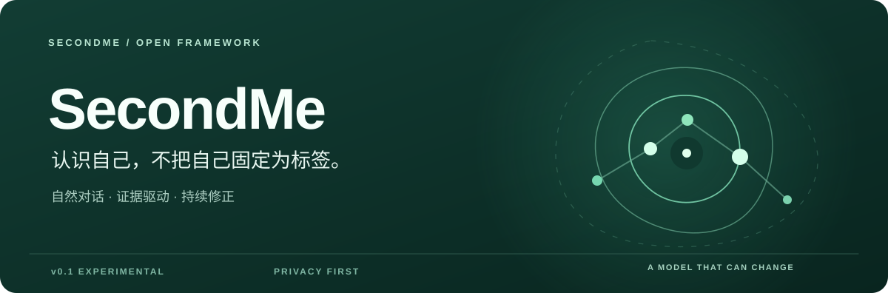
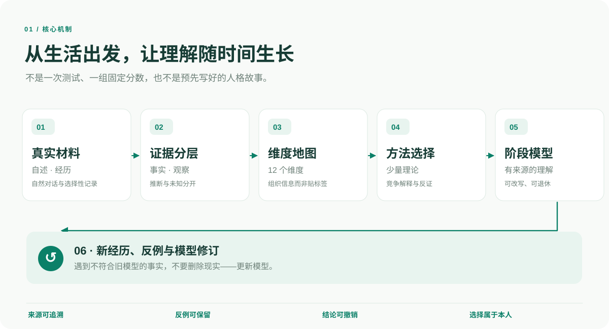
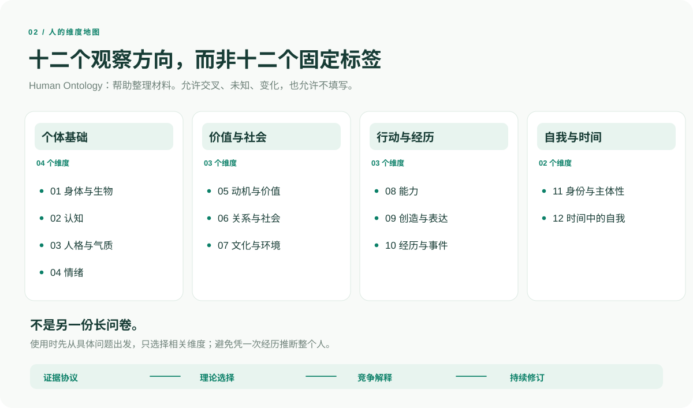
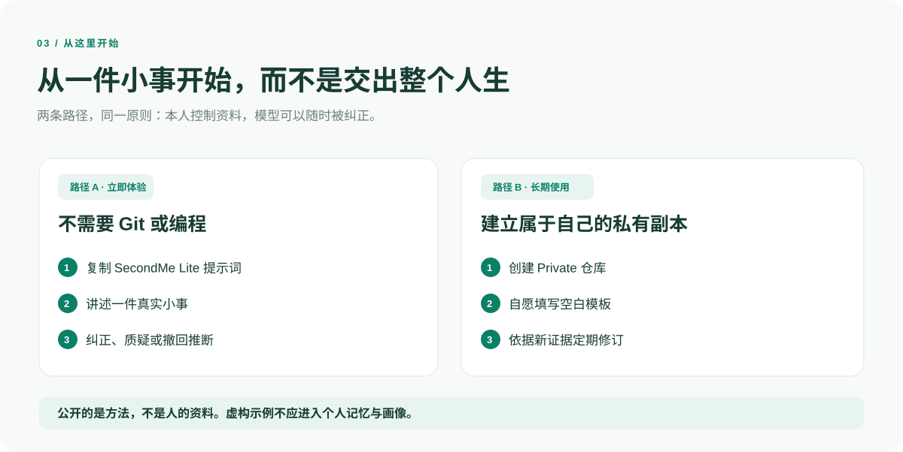

# SecondMe Framework

<p align="center">
  
</p>

<p align="center">
  <strong>一个持续修正的自我理解框架。</strong>
  <br>
  从真实经历与自然对话出发，用证据而不是标签理解自己。
</p>

<p align="center">
  <a href="prompts/secondme-lite.md">即刻体验</a> ·
  <a href="#如何运作">框架总览</a> ·
  <a href="#方法与理论">维度与理论</a> ·
  <a href="PRIVACY.md">隐私原则</a>
</p>

<p align="center"><sub>Experimental v0.2 · 中文优先 · MIT License · Privacy-first</sub></p>

---

## 为什么是 SecondMe？

我们会改变。一次测试、一段聊天或一个人格标签，都不足以概括一个真实的人。

SecondMe 希望做的，是把**生活中的真实材料**转化为**有来源、可质疑、能随着时间改变的工作模型**。

| 原则 | 这意味着什么 |
| --- | --- |
| **证据优先** | 明确区分「本人自述」「直接观察」「推断」「未知」。 |
| **动态更新** | 允许矛盾、反例和变化；旧结论可以降权、改写或退休。 |
| **主体性优先** | 心理学理论与 AI 是参考，不是替你定义人生的权威。 |
| **隐私优先** | 公开可复用的方法；个人经历与记录只存在于你选择的私有空间。 |

**它不是**临床诊断工具、正式人格测评，也不是已经接通所有历史记录的数字分身。

## 如何运作



使用时不会要求你完成所有步骤的复杂填报。可以只从一个问题开始，**按需要选择最少的方法**。

- **真实材料**：聊天、自述、经历与使用者自愿提供的观察。
- **证据协议**：保留来源；区别事件、观察、推断、外部观点和未知。
- **维度地图**：以 12 个观察维度整理信息，不形成统一人格总分。
- **方法选择**：依据具体问题选择 1–3 个有解释增益的视角。
- **阶段模型**：解释需包含适用范围、其他可能性和可推翻它的证据。
- **持续修订**：后来发生的真实经历，可以改变甚至否定此前的模型。

## 人的十二个维度



**12 个维度是整理材料的分类地图，不是 12 个已验证、彼此独立的人格因子。** 可以交叉、留空，或随着理解加深而改变。详见 [Human Ontology](framework/human_ontology.md)。

## 方法与理论

面对不同问题，SecondMe 不会用某一个理论解释所有人。下面是**可选的参考池**，并不代表已部署自动打分、模型训练或完成临床效度验证。

| 分析方向 | 可参考的理论或方法 | 典型问题 |
| --- | --- | --- |
| 人格与气质 | 大五人格、HEXACO | 哪些倾向跨情境相对稳定？ |
| 认知与学习 | 元认知、认知风格、信息加工 | 怎样学习、推理和修正看法？ |
| 动机与价值 | 自我决定理论、期待—价值 | 为什么愿意做、又为何犹豫？ |
| 情绪与情境 | 情绪调节、情境反应 | 哪些情境会改变感受？ |
| 关系与互动 | 依恋理论、双人互动与边界 | 如何处理双方不同的需要？ |
| 身份与时间 | 叙事身份、自我差异、可能自我 | 我如何理解变化中的自己？ |
| 选择与行动 | 决策权衡、趋近—回避、人—环境适配 | 选择的成本、可能性和可逆性是什么？ |
| 发展与环境 | 生态系统视角、人生历程 | 环境、文化与人生阶段怎样起作用？ |

**Method Router** 先看问题、证据和时间尺度，再选择理论，并寻找竞争解释。如果证据不足，**不知道**也是合格答案。参见 [方法选择器](framework/method_router.md)。

### 证据分类

`SELF_REPORTED` 本人自述 · `EVENT` 具体事件 · `OBSERVED` 可观察材料 · `INFERRED` 候选推断 · `EXTERNAL` 外部参考 · `UNKNOWN` 未知。

它们是**来源与推断状态标签**，不是对人的评价分数。详见 [证据协议](framework/evidence_protocol.md)、[模型更新](framework/model_update.md) 与 [主体性边界](framework/agency_and_external_advisors.md)。

## 从这里开始



**路径 A · 五分钟体验**

1. 打开 [SecondMe Lite 提示词](prompts/secondme-lite.md)，复制到日常使用的 AI 聊天工具。
2. 从最近一件真实的小事聊起，不用做长问卷。
3. 让 AI 区分事实、解释、反例与未知；发现不准确就直接纠正。

**路径 B · 建立长期私有模型**

1. 创建自己的 **Private** 仓库，用本项目的 [空白模板](templates/) 作为起点。如果 GitHub 页面显示 **Use this template**，可直接从模板创建；否则需要由维护者启用该仓库选项。
2. 只记录你愿意保存的内容。私有仓库不等于本地加密，涉及健康、关系等敏感材料时应进一步最小化。
3. 用 [阶段复盘提示词](prompts/review.md) 根据新经历调整旧认识，不让 AI 擅自增加人生任务。

## 框架更新：不覆盖私人资料

朋友通过模板创建自己的私有 SecondMe 后，并不具备 GitHub 原生的 Fork 同步功能。因此 v0.2 加入了 **[SecondMe Updater](docs/UPDATES.md)**：

- **定期或手动检查**公开框架的新版本；
- 只选择性更新 `framework/`、`prompts/`、`templates/` 中未经用户修改的官方 Markdown；
- 遇到已修改文件就**跳过并报告冲突**，个人资料、个性化设置、示例及可执行脚本不自动同步；
- 在使用者的**私人仓库**内生成待审核 Pull Request，**不会自动合并**。

`my/` 可用于私人仓库中自愿版本管理的个人资料，`custom/` 用于定制。需要离线保留的内容可自行放进 `.private/`（已列入 Git 忽略规则）。**Private GitHub 仓库仍是云端服务，不代表端到端加密。**

> 更新器当前基线是 **v0.2.0**；这是已经提供的更新机制，不代表已有待升级的新版本。使用前需要仓库启用 GitHub Actions 及适当的 PR 权限。[查看安装与权限说明 →](docs/UPDATES.md)

## 开源框架如何持续演化？

每个人都可以在自己的私人 SecondMe 中长期探索；当发现可推广的方法时，**先在私人环境里审查、独立重写成通用内容，再经人工确认发布到公开仓库**。私人经历与 Git 历史不能自动上行。

公开方法的新版本，则通过版本指纹和可审核 PR，供每个使用者按自己的意愿更新；不会覆盖个人资料或个性化模型。

[了解方法演化与发布规范 →](docs/EVOLUTION.md) · [查看安全更新机制 →](docs/UPDATES.md)

## 项目结构

```text
SecondMe-Framework/
├── prompts/       自然对话与回顾提示词
├── framework/     维度、证据、理论选择、更新与主体性
├── templates/     个人模型、经历、决策与复盘空白模板
├── examples/      独立虚构的教学材料（非个人记忆）
├── docs/assets/   中文 SVG 框架图及视觉素材
├── docs/UPDATES.md 框架更新说明与权限配置
├── scripts/      安全更新器与发布清单工具
├── .secondme/    官方版本清单与文件指纹
├── .github/      提议更新 PR 的可选工作流
├── tests/        防覆盖与路径安全的离线测试
├── PRIVACY.md     隐私与脱敏边界
├── CONTRIBUTING.md
└── ROADMAP.md
```

### 示例与记忆的边界

[examples/](examples/) **只用于演示方法，不是标准答案，更不是使用者的个人记忆**。浏览仓库或创建副本不会自动导入示例；但如果把整个仓库作为 AI 检索材料，示例仍可能产生叙事锚定。因此，私人使用时请将 `examples/` **排除在人物记忆、画像和蒸馏输入之外**。

### 隐私与贡献

这个仓库**不承载真实的 SecondMe 个人档案**。请勿通过公开 Issue、PR 或示例提交真实聊天、健康资料、亲密关系记录或改名后的真实案例。详见 [PRIVACY.md](PRIVACY.md) 和 [CONTRIBUTING.md](CONTRIBUTING.md)。

当前 **v0.2** 提供了提示词、方法文档、空白模板、虚构教学示例，以及可选的框架版本检查与更新 PR；**尚未实现**自动跨会话记忆、数据库、可视化交互界面、正式测量或数字人运行时。后续想法见 [ROADMAP.md](ROADMAP.md)。

---

<p align="center"><strong>好的自我模型，应当允许未来的你证明今天的模型是错的。</strong></p>
<p align="center"><sub>Open methods. Private lives. A model that can change.</sub></p>
