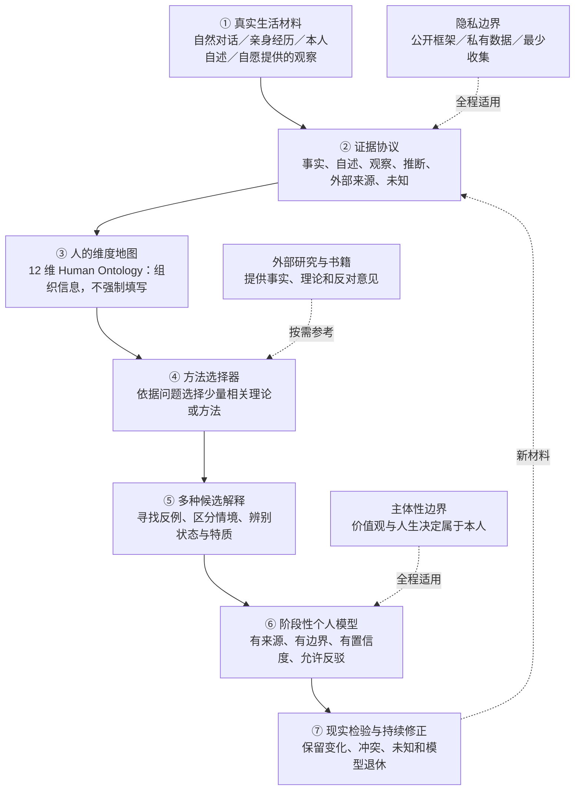
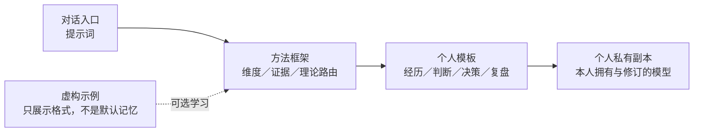

# SecondMe Framework｜持续修正的自我理解框架

> **认识自己，但不把自己固定成标签。**
>
> 一个开放、证据优先、尊重主体性与隐私的长期自我理解方法框架。

**实验版本 v0.1 · 中文优先 · 无需编程也能开始**

SecondMe 通过**自然对话 → 记录经历 → 区分证据 → 选择解释方法 → 检查反例 → 更新个人模型**的循环，让人逐渐了解自己的认知、人格、情绪、关系与人生选择。

**这个仓库只分享通用方法；每个人的真实资料应保存在自己的私有空间。**

这不是临床诊断、正式人格量表、人生预测系统，也不假装 AI 能读取它实际看不到的历史。

## 01 · 项目总框架图

下面展示的是方法流程，**不是已经部署的自动数据处理流水线**。

### 实际使用分层

## 02 · 五分钟开始

**只想和 AI 聊一聊：**

1. 打开 [SecondMe Lite 提示词](prompts/secondme-lite.md)，复制到你日常使用的 AI 聊天工具。
2. 从近期一件真实的小事聊起，**无需先填长问卷**。
3. 随时要求区分「你说过的话」「模型的推断」「替代解释」「尚不知道的事」。
4. 想做阶段总结时，使用 [复盘提示词](prompts/review.md)。

**想长期保存自己的模型：**

1. 使用 GitHub 的 **Use this template**，创建**新的 Private 仓库**（如仓库尚未被设为 Template，也可手动复制空白模板）。
2. 在自己的私有副本内填写 [templates/](templates/)，不要在本公开仓库填写个人资料。
3. 定期检查新证据是否支持或推翻旧判断。
4. 不必公开任何真实人物档案，也不必把所有资料上传第三方 AI。

详细风险提醒：[PRIVACY.md](PRIVACY.md)。

## 03 · 人的 12 个维度

**Human Ontology 是整理信息的维度地图，不是人格测评、更不是 12 个打分项。** 它们不是完全相互独立的因子，也不要求对每个人全部采集。

| 类别 | 维度 | 观察方向 |
| --- | --- | --- |
| 个体基础 | ① 身体与生物 | 身体状况、精力与现实限制（可完全不记录） |
| 个体基础 | ② 认知 | 学习、推理、注意、记忆和元认知 |
| 个体基础 | ③ 人格与气质 | 跨场景较稳定的行为倾向 |
| 个体基础 | ④ 情绪 | 感受、表达、调节、情境差异 |
| 价值与社会 | ⑤ 动机与价值 | 兴趣、需要、选择与意义 |
| 价值与社会 | ⑥ 关系与社会 | 互动、角色、边界与互惠 |
| 价值与社会 | ⑦ 文化与环境 | 文化、教育、资源、制度和时代 |
| 行动与经历 | ⑧ 能力 | 技能、知识、实践经验与证据 |
| 行动与经历 | ⑨ 创造与表达 | 作品、探索、审美和表达 |
| 行动与经历 | ⑩ 经历与事件 | 事实、转折、选择、具体背景 |
| 自我与时间 | ⑪ 身份与主体性 | 自我叙事、选择权、拒绝标签的权利 |
| 自我与时间 | ⑫ 时间中的自我 | 过去、现在、未来与人生阶段变化 |

详见 [framework/human_ontology.md](framework/human_ontology.md)。

## 04 · 证据、解释与置信度

| 标签 | 是什么 | 不能直接推导成什么 |
| --- | --- | --- |
| `SELF_REPORTED` | 本人明确表达的感受、观点、自述 | 未经核实的外部事实 |
| `EVENT` | 有情境的具体经历 | 稳定人格 |
| `OBSERVED` | 从已提供材料中直接观察到的现象 | 唯一因果解释 |
| `INFERRED` | 有证据支持的暂定推断 | 绝对身份定论 |
| `EXTERNAL` | 外部书籍、论文或他人观点 | 本人认同的价值观 |
| `UNKNOWN` | 暂时不知道或证据不足 | 可以任意补全的空白 |

- **置信度**是对证据质量的审慎描述，不应凭空生成「87% 匹配」之类的数字。
- 同一个人的表现可能随时间、关系、环境改变；**状态 ≠ 特质**。
- 梦、幻想、角色创作不能自动被当作现实意图。
- AI 输出的优美表述不能冒充用户亲口说过的话。

详见 [framework/evidence_protocol.md](framework/evidence_protocol.md)。

## 05 · 方法类别与理论参考池

**注意：以下是按需参考的候选工具，并不代表该仓库已经集成、运行、验证这些理论的自动评分或预测模型。**

| 方法类别 | 可参考的理论或视角 | 适合回答的问题 |
| --- | --- | --- |
| 人格与差异 | 大五人格、HEXACO | 哪些倾向可能跨情境稳定？ |
| 认知与学习 | 元认知、认知风格、信息加工 | 怎么思考、理解和修正认识？ |
| 动机与价值 | 自我决定理论、期待—价值框架 | 为什么愿意做、又为何犹豫？ |
| 情绪与调节 | 情绪调节、情境—反应视角 | 某种感受在什么条件下出现？ |
| 关系与互动 | 依恋理论、双人互动、边界与互惠 | 双方真正需要什么、如何相处？ |
| 身份与人生叙事 | 叙事身份、自我差异、可能自我 | 如何理解过去与未来的自己？ |
| 选择与行动 | 决策权衡、趋近—回避、人—环境适配 | 选项的价值、成本和可逆性是什么？ |
| 环境与发展 | 生态系统视角、人生历程 | 个体、角色与制度如何相互影响？ |

**Method Router 的顺序**：具体问题 → 证据类型和时间尺度 → 选用 1–3 个有增益的视角 → 竞争解释 → 现实检验 → 修订；如果没有合适理论，就允许「尚不能判断」。

详见 [framework/method_router.md](framework/method_router.md)、[framework/model_update.md](framework/model_update.md) 和 [framework/agency_and_external_advisors.md](framework/agency_and_external_advisors.md)。

## 06 · 项目模块及目前实现状态

| 模块 | 文件 | v0.1 状态 |
| --- | --- | --- |
| 自然对话与阶段回顾 | [prompts/](prompts/) | 可复制使用 |
| 12 维信息组织 | [human_ontology.md](framework/human_ontology.md) | 方法文档 |
| 来源与证据协议 | [evidence_protocol.md](framework/evidence_protocol.md) | 方法文档 |
| 理论选择与反证 | [method_router.md](framework/method_router.md) | 方法文档 |
| 模型版本与修订 | [model_update.md](framework/model_update.md) | 方法文档 |
| 用户主体性 / 外部顾问边界 | [agency_and_external_advisors.md](framework/agency_and_external_advisors.md) | 方法文档 |
| 个人记录空模板 | [templates/](templates/) | 可用于私人副本 |
| 完全虚构的教学示例 | [examples/](examples/) | 可选阅读 |
| 自动记忆、数据库、可视化、数字人运行时 | — | 尚未实现 |

## 07 · 示例会不会干扰记忆？

[examples/](examples/) 中的材料**完全虚构，仅演示格式与反证方法**。仅在 GitHub 浏览或从模板创建新仓库，不会自动把示例写入 AI 的个人记忆。

但**如果你将示例内容粘贴给 AI、让 AI 索引整个仓库，或者把示例并入个人档案，它可能造成上下文锚定**。

因此，建议：
- 个人建模时只提供**本人愿意使用的真实材料**及空白模板；
- 把 `examples/` 排除出个人知识检索、模型总结、人格记忆和蒸馏；
- 不把虚构人物的性格、价值与措辞复制到本人画像；
- 需要时直接删掉私人副本中的 `examples/`。

> **示例用于学习方法，不是标准答案，更不是任何人的默认记忆。**

## 08 · 安全边界与贡献

- **公开方法，私有生活**：不提交真实人物案例、心理健康记录、梦境原文、私人聊天、联系人与可重识别的改写材料。
- **主体性优先**：外部理论可提供事实与反对意见，不能自动成为用户的人生目标。
- **只使用实际可访问的证据**：模型不应虚构跨会话记忆或量表结果。
- **科学表达有界**：这套框架不是临床工具；理论引用不意味着自动建立心理测量效度。
- **尊重他人**：不要用私人沟通训练公开案例；关于他人的解释只能是使用者视角，不代替他人发声。

见 [隐私说明](PRIVACY.md)、[贡献原则](CONTRIBUTING.md)、[后续规划](ROADMAP.md)、[开源许可证](LICENSE)。

---

**一个好的自我模型，应当允许未来的你证明今天的模型是错的。**

*SecondMe Framework — learn from your life; never surrender your agency.*